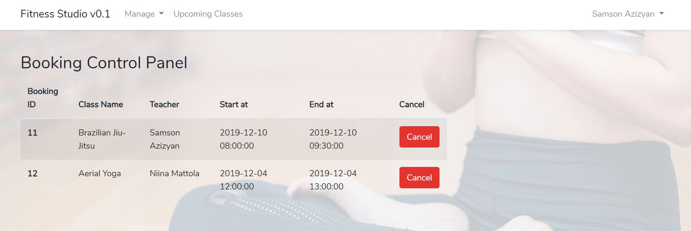
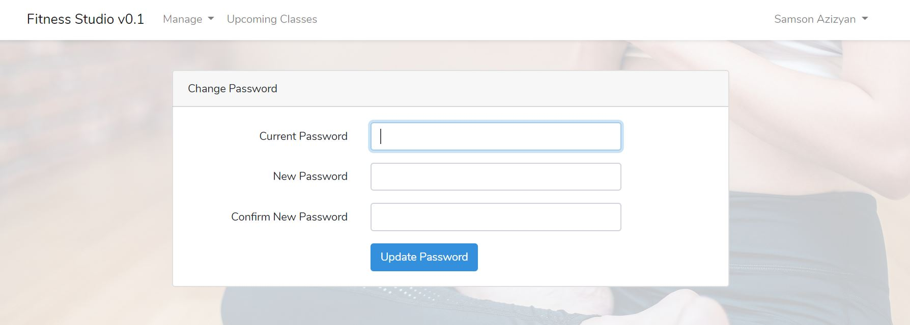
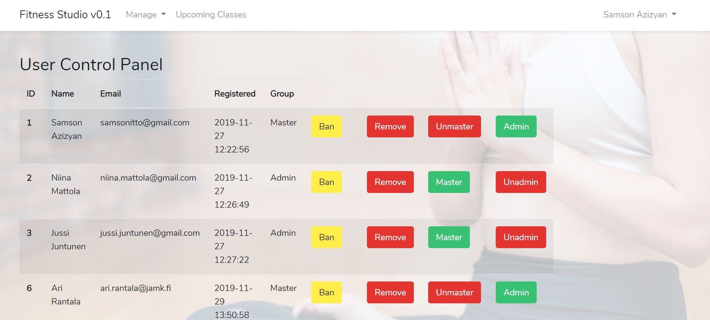

# TTMS0900 (Web-palvelinohjelmointi) ja TTMS0500 (Webohjelmointi) Kurssijen yhdistetty harjoitustyö - Fitness Studio

## Tekijä

* Samson Azizyan (M3156)
* M3156 
* Versionumero 0.1
* [Fitness Studio](http://142.93.231.94/)

## Sisällysluettelo 

* [Vaatimusmäärittely](#vaatimusmäärittely)
    * [Sovelluksen yleiskuvaus](#sovelluksen-yleiskuvaus)
    * [Kohdeyleisö](#kohdeyleisö)
    * [Käyttöympäristö ja käytetyt teknologiat](#käyttöympäristö-ja-käytetyt-teknologiat)
    * [Käyttäjäroolit](#käyttäjäroolit)
    * [Ominaisuudet](#ominaisuudet)
    * [Käyttötapaukset](#käyttötapaukset)
    * [Hyväksyntätestit](#hyväksyntätestit)
    * [Käsitemalli](#käsitemalli)
    * [Luokkakaavio](#luokkamalli)
    * [Työnjako](#työnjako)
    * [Työaikasuunnitelma](#työaika-suunnitelma)
* [Loppuraportti](#loppuraportti)
    * [Asennus](#asennus)
    * [Tetoa ohjelmasta](#tietoa-ohjelmasta)
    * [Kuvaruutukaappaukset](#kuvaruutukaappaukset)
    * [Mukana tulevat tiedostot](#mukana-tulevat-tiedostot)
    * [Tietokanta](#tietokanta)
    * [Ongelmat, jatkokehitysideat](#ongelmat-jatkokehitysideat)
    * [Työmäärä](#työmäärä)
    * [Yhteenveto](#yhteenveto)

# Vaatimusmäärittely

## Sovelluksen yleiskuvaus

Tarkoituksena on suunnitella ja toteuttaa websovelluksen imaginääristä liikuntapalveluja tarjoavaa yritystä. Palvelun käyttäjät voisivat tehdä liikuntatuntivarauksia ja palvelun ylläpitäjät/vetäjät pystyisivät poistaamaan köyttäjiä tai antaamaan nille varauskieltoa.

## Kohdeyleisö

Kohdeyleisö on liikuntapalvelua tarjoavat yritykset ja niiden asiakkaat.

## Käyttöympäristö ja käytetyt teknologiat

* Laravel
* React.js
* node.js
* Mysql
* Javascript
* Jquery
* Php
* Visual Studio Code
* notepad++
* putty
* apache
* Digital Ocean
* Ubuntu Linux

## Käyttäjäroolit

### Asiakas

Asiakas käyttää sovellusta varatakseen liikuntatunteja ja nähdäkseen treenikalenterin.

### Admin / Vetäjä

Admin ylläpitää palvelua: lisää/poistaa tulevat liikuntatunnit, antaa varauskieltoa, poistaa käyttäjät

### Master

Master-käyttäjä ylläpitää palvelua: lisää/poistaa tulevat liikuntatunnit, antaa varauskieltoa, poistaa käyttäjät, ylläpitää admin/master/user käyttöoikeuksia

## Ominaisuudet

| Tunnus | Ominaisuus | Prioriteetti | Muuta |
| :-: | :-: | :-: | :-: |
| FT01 | [ Tunnusten luominen ja kirjautuminen](links/f1_login.md) | Pakollinen | |
| FT02 | [ Lisää/poistaa varauksia ](links/f2_bookings.md) | Pakollinen | |
| FT03 | [ Tunnusten poistaminen](links/f3_delete_account.md) | Pakollinen | |
| FT04 | [ Profiilin editointi](links/f4_edit_account.md) | Pakollinen | |
| FT05 | [ Admin/Master ominnaisuudet](links/f5_admin.md) | Nice to Have | |
| FT06 | [ Lisää/poista liikuntatunti ](links/f6_add_a_class.md) | Nice to Have | |

## Käyttötapaukset

### Tunnusten luominen ja kirjautuminen

**Käyttötapauksen kuvaus**

1. Käyttäjä luo tunnukset
2. Käyttäjä kirjautuu palveluun

**Poikkeukset**
 
* P1 Käyttäjä ei täyttänyt kaikki kentät oikein, saa virheilmoituksen
* P2 Käyttäjä ei muista salasanaa, ottaa yhteyttä ylläpitoon
	
**Lopputulos**	

* Asiakas on luonut tunnukset ja on päässyt kirjautumaan iTool sovellukseen

**Käyttötiheys** 

* Tunnusten luominen: Kerran per sähköposti
* Kirjautuminen: rajaton

### Liikuntatuntien selailu, varaus ja poistaminen

**Käyttötapauksen kuvaus**

1. Käyttäjä selaa tulevia liikuntatunteja
2. Käyttäjä varaa paikan liikuntatunnilla
3. Käyttäjä selaa omia varauksia
4. Käyttäjä peruuttaa varauksen
6. Sovellus poistaa varauksen tietokannasta

	
**Lopputulos**	

* Käyttäjä on varannut, tai poistanut varauksen

**Käyttötiheys** 

* Varaus: sen verran kun on vapaita paikkoja liikuntatunnilla
* Peruuts: kerran per varaus

### Tunnusten poistaminen

**Käyttötapauksen kuvaus**

1. Käyttäjä poista tunnukset
2. Tunnukset poistetaan tietokannasta

**Lopputulos**	

* Käyttäjän tunnukset on poistettu tietokkannassa

**Käyttötiheys** 

* Kerran per sähköposti

## Hyväksyntätestit

| TestiID | Kuvaus |								
|:-:|:-:|
| AT01 | [Tunnusten luominen ja sovellukseen kirjautuminen](linkit/at1_tunnusten_luominen.md) |
| AT02 | [Liikuntatunnin varaus/peruutus](linkit/at2_add_class_.md) |
| AT03 | [Tunnusten editointi](linkit/at3_edit_profile.md) |
| AT04 | [Tunnusten poistaminen](linkit/at4_delete.md) |
| AT05 | [Admin/master ominaisuudet](linkit/at5_admin.md) |

## Käsitemalli

### Käsitteet

1. User: Fitness Studio sovelluksen käyttäjä
2. Booking: Liikuntatunnin varaus
3. Class: Liikuntatunnin tyyppi
4. Class_is_available: Tarjolla oleva liikuntatunti
5. Calendar: Liikuntakalenteri
6. Admin: Admin käyttäjä
7. Master: Master käyttäjä
8. Teacher: Admin/Master, joka vetää liikuntatunnin

## Luokkamalli

## Työnjako

Samson Azizyan
Suunnittelu, front end, back end, testit, Mysql database, Laravel.

## Työaika

* Viikko 47: Digital Ocean palvelimen setup, Laravel ympäristön asennus, mysql tietokannan
toteutus (20h)
* Viikko 48: Blade näkymät, reititys, tietokannan migratiot ja testidata, itseopiskelu, Reactin asennus Laravel ympäristöön, front end ohjelmointi, back end ohjelmointi (50h)
* Viikko 49: Dokumentointi, testaaminen, bugien korjaus (10h)

# Loppuraportti

## Asennus
* Sovellus on pakattu zip-pakkaukseen, pakkaus pitää purkkaa sellaisenaan
* Hakemistorakenteen pitää olla tasan tarkkaan sellainen kun pakkauksessa, koska sovellus käyttää 'images' - kansiotta kuvien tallentaamiseen ja esittämiseen
* Exe-tiedosto löytyy bin/Debug kansiosta
* Sovelluksen käyttöä varten pitää olla joko kirjautuneena labranetin tietokoneelle tai käyttää labranetin VPN-yhteyttä, koska tietokanta sijaitsee mysql.labranet palvelimella

## Tietoa ohjelmasta

Sovellus on toteutettu suunnitelman mukaan, ei poikennut vaatimusmäärittelystä.

### Toteutetut toiminnalliset vaatimukset

| Tunnus | Ominaisuus | Prioriteetti | Toteuttumisprosentti | Muuta |
| :-: | :-: | :-: | :-: | :-: |
| FT01 | [ Tunnusten luominen ja kirjautuminen](links/f1_login.md) | Pakollinen | 100% ||
| FT02 | [ Lisää/poistaa varaus ](links/f2_booking.md) | Pakollinen | 100% ||
| FT02 | [ Lisää/poistaa varauksia ](links/f2_bookings.md) | Pakollinen | 100% ||
| FT03 | [ Tunnusten poistaminen](links/f3_delete_account.md) | Pakollinen | 100% ||
| FT04 | [ Profiilin editointi](links/f4_edit_account.md) | Pakollinen | 100% ||
| FT05 | [ Admin/Master ominnaisuudet](links/f5_admin.md) | Nice to Have | 100% ||
| FT06 | [ Lisää/poista liikuntatunti ](links/f6_add_a_class.md) | Nice to Have | 60% ||

### Toteuttamatta jääneet toiminnalliset vaatimukset

Yksi, joka on jäänyt toteutumtta on "posta liikuntatunti". Laravel ei hyväksynyt Reactista saapuvan DELETE metodia. Ilmestyi koko ajan FORBIDDEN 403 virhe. 

Toinen ongelma oli silloin kun yritin asentaa erillisen kalenteri-komponentin Reactiin.
Sain asennettu komponentin, mutta en saanut siihen dataa tietokannasta.

## Kuvaruutukaappaukset

### 'Login'-sivu

* Login ikkunassa pystyy kirjautumaan Fitness Studioon sisään.

### 'Register'-sivu

* Register ikkunassa pystyy rekiströitymään fitness-studioon, kaikki kentät on pakollisia.

### 'Classes'-sivu

* Classes-ikkunssa voi selailla ja varata tulevia liikuntatunteja
* Liikuntatuntia kllikkaamalla pääsee lukemaan enemmän infoa tunnista
* Take Class - näppäintä klikkaamalla varataan liikuntatunnin
* Adminit ja Masterit näkee "Add Class" - ikkunan, josta pääsee lisäämään tulevia liikuntatunteja

### 'Bookings'-sivu

* Bookings sivulla pääsee selaamaan omat tulevat liikuntatunnit.
* Pystyy myös peruuttaamaan ne

### 'Settings'-sivu

* Settings sivulla näkee omat tiedot
* Voi vaihtaa salasana
* Voi vaihtaa s-posti
* Voi poistaa tunnukset

### 'Change Password'-sivu

* Change Password sivulla voi vaihtaa salasana

### 'Change Email'-sivu

* Change Email sivulla pääsee vaihtaa s-posti

### Users-sivu

* Users sivulla adminit ja masterit pystyy hallinoimaan käyttäjiä.
* Antaa bannia
* Peruuttaa bannit
* Poistaa käyttäjät
* Ylentää (master)
* Alentaa (master)

## Mukana tulevat tiedostot

* Mukana tulee [zip-pakkaus](https://student.labranet.jamk.fi/~M3156/iTool/iTool_v0.1.zip)

## Tietokanta

Tietokannan suunnittelin tietokannat opintojakson harjoitustyönä. Tietokannasta on luotu 2 versitota prosessin aikana.

### iTool tietokanta versio 1

Tässä versiossa tietokannassa oli tr_completion taulu, se taulu oli työkalun palautusta varten. Käyttäjä palauuttaa työkalun, samalla palautustapahtuma tallentuisi
tr_completion tauluun, johon kirjautuu palautus PVM, palautus kunto ja arvio kaupan toisesta osapuolesta. Transaction ja tr_completion taulujen välissä oli
yksi yhteen liitos, joten tr_completion on jätetty kokonaan pois ja transaction tauluun on lisätty palautusPVM (actualEndDate) kenttä, joka transaction käynnistyessä olisi null. 

### iTool tietokanta lopullinen versio 2

Tässä on lopullinen versio iTool tietokannasta, tr_completion taulu on jätetty pois ja tietokantaan on lisätty rating taulu arvioita varten. Rating taululle on tehty [trigger](liitteet/trigger.md),
joka pitää huolta siitä, että käyttäjä joka jättää arvion voi vain ainoastaan arvioida kyseisen transaktion toista osapuolta yhden kerran. Comment taulussa on itseensä liitos,
koska vastaukset kommenteihin vaatii parentID. 

[Täältä löytyy tietokannan luontiskripti](liitteet/database_script.md)

[Queryhistoriasta](liitteet/queryhistory.md) löytyy näkymien luonti, testidatan lisäys ja erilaisia hakuja. Piti luoda 2 isoa näkymää (all_tools ja rented_tools) käyttöliittymän
toiminnallisuutta varten.

## Ongelmat, jatkokehitysideat

Tämä sovellus oli vaan hiekkalaatikkoprototyyppi mahdollisesta tulevasta toimivasta sovelluksesta, siihen nähden ei ole esiintynyt hirveän isoja ongelmia.
On olemassa kuitenkin muutamaa kehitysideaa.

### Kommentit

* Kommentit ei esinny oikeassa järjestyksessä
* Täytyy käydä koodi läpi ja parantaa
* Kommentteihin täytyy pystyä päästä käsiksi myös Profiili-ikkunasta (pieni ja helppo päivitys)

### Images kansio

* Images kansio on olemassa vain paikallisesti
* Täytyy siirtää webclietille, jota se päivittyisi kaikilla käyttäjillä dynaamisesti

### Tietokantakyselyt

* Koodissa on vähän liikaa ylimääräisiä yhteydenottoja mysql palvelimelle
* Pitää muuttaa koodia, että otetaan vaan kerran per uusi ikkuna yhteyden palvelimelle
* Täytyy implementoida 'Entity Framework' tulevissa versioissa

### Samanaikainen kirjautuminen

* Täytyy implementoida sellainen toiminnallisuus, jolla sama käyttäjä ei voisi olla kirjautuneena moneella päätelaitteella samanaikaisesti

### Katselmoinnin aikana ilmestyneet bugit

* Lisättäessä uusi työkalu ilmeni ongelma samannimisen kuvatiedoston kanssa (bugi korjattu)
* Käyttäjä pystyi poistamaan oman profiilin vaikka sillä oli auki olevia transaktioita (bugi korjattu)

## Työmäärä

Olen tehnyt kaiken yksin, joten on mennyt paljon aikaa tekemiseen. Täältä löytyy karkea arvio työtunneista:

* XAML ja ulkoasu: 15h
* Code behind: 25h
* Tietokanta: 10h
* Dokumentointi: 5-10h

## Yhteenveto

* Samson Azizyan (M3156)
* Arvosanaehdotus: 5
* Perustelut: Asetin itselleni arvosanaehdotukseksi 5, koska tein tosi paljon hommaa ja siihen kului noin 60h. Saattoi olla vähän liian kunniahimoinen projekti. Lopputulokseen olen tyytyväinen, kaikki toimii niin kuin pitääkin. Ulkoasu olisi voinut olla näyttävämpi, mutta toiminnallisuus oli prioriteettina tässä projektissa. Tietokanta oli monipuolinen ja hyvin toimiva. Tämä on hyvä pohja jatkokehitystä varten.
* Mitä opin: Opin tekemään yksinkertaisia käyttöliittymiä, implementoimaan mysql-tietokantoja, opin syvemmin käsittelemään olioita ja luokkia. Tämän opintojakson aikana minun ohjelmointitaito on kolmenkertaistunut.
* Mitä pitää oppia: Käsittelemään interfaceja, käyttämään webclientia (tallentamaan sinne tiedostoja), Entity Framework
