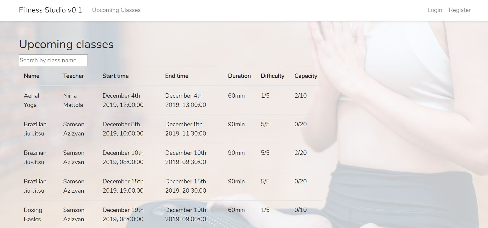
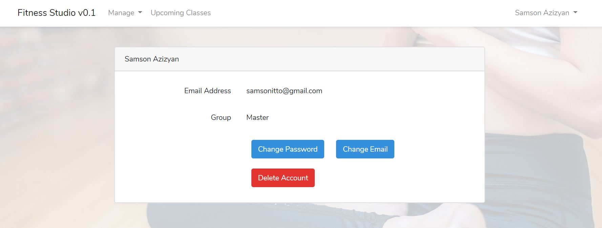

# TTMS0900 (Web-palvelinohjelmointi) ja TTMS0500 (Webohjelmointi) Kurssijen yhdistetty harjoitustyö - Fitness Studio

## Tekijä

* Samson Azizyan (M3156)
* M3156 
* Versionumero 0.1
* [Fitness Studio](http://142.93.231.94/)

## Sisällysluettelo 

* [Vaatimusmäärittely](#vaatimusmäärittely)
    * [Sovelluksen yleiskuvaus](#sovelluksen-yleiskuvaus)
    * [Kohdeyleisö](#kohdeyleisö)
    * [Käyttöympäristö ja käytetyt teknologiat](#käyttöympäristö-ja-käytetyt-teknologiat)
    * [Käyttäjäroolit](#käyttäjäroolit)
    * [Ominaisuudet](#ominaisuudet)
    * [Käyttötapaukset](#käyttötapaukset)
    * [Käsitemalli](#käsitemalli)
    * [Luokkakaavio](#luokkamalli)
    * [Työnjako](#työnjako)
    * [Työaikasuunnitelma](#työaika-suunnitelma)
* [Loppuraportti](#loppuraportti)
    * [Asennus](#asennus)
    * [Tetoa ohjelmasta](#tietoa-ohjelmasta)
    * [Kuvaruutukaappaukset](#kuvaruutukaappaukset)
    * [Tietokanta](#tietokanta)
    * [Ongelmat, jatkokehitysideat](#ongelmat-jatkokehitysideat)
    * [Työmäärä](#työmäärä)
    * [Yhteenveto](#yhteenveto)

# Vaatimusmäärittely

## Sovelluksen yleiskuvaus

Tarkoituksena on suunnitella ja toteuttaa websovelluksen imaginääristä liikuntapalveluja tarjoavaa yritystä varten. Palvelun käyttäjät voisivat tehdä liikuntatuntivarauksia ja palvelun ylläpitäjät/vetäjät pystyisivät poistaamaan käyttäjiä, antaamaan nille varauskieltoa ja lisäämään tulevia liikuntatunteja.

## Kohdeyleisö

Kohdeyleisö on liikuntapalvelua tarjoavat yritykset ja niiden asiakkaat.

## Käyttöympäristö ja käytetyt teknologiat

* Laravel
* React.js
* node.js
* Mysql
* Javascript
* Jquery
* Php
* Visual Studio Code
* notepad++
* putty
* apache
* Digital Ocean
* Ubuntu Linux

## Käyttäjäroolit

### Asiakas

Asiakas käyttää sovellusta varatakseen liikuntatunteja ja nähdäkseen treenikalenterin.

### Admin / Vetäjä

Admin ylläpitää palvelua: lisää/poistaa tulevat liikuntatunnit, antaa varauskieltoa, poistaa käyttäjät

### Master

Master-käyttäjä ylläpitää palvelua: lisää/poistaa tulevat liikuntatunnit, antaa varauskieltoa, poistaa käyttäjät, ylläpitää admin/master/user käyttöoikeuksia

## Ominaisuudet

| Tunnus | Ominaisuus | Prioriteetti | Muuta |
| :-: | :-: | :-: | :-: |
| FT01 |  Tunnusten luominen ja kirjautuminen | Pakollinen | |
| FT02 |  Lisää/poistaa varauksia | Pakollinen | |
| FT03 |  Liikuntatuntien selailu | Pakollinen | |
| FT04 |  Liikuntatuntien haku | Nice to have | |
| FT05 |  Tunnusten poistaminen | Pakollinen | |
| FT06 |  Profiilin editointi | Pakollinen | |
| FT07 |  Admin/Master ominnaisuudet | Pakollinen | |
| FT08 |  Bännää käyttäjiä  | Pakollinen | |
| FT09 |  Unbännää käyttäjiä  | Pakollinen | |
| FT10 |  Käyttäjäkuvat  | Nice to have | |
| FT11 |  Lisää/poista liikuntatunnit  | Pakollinen | |

## Käyttötapaukset

### Tunnusten luominen ja kirjautuminen


**Käyttötapauksen kuvaus**

1. Käyttäjä luo tunnukset
2. Käyttäjä kirjautuu palveluun

**Poikkeukset**
 
* P1 Käyttäjä ei täyttänyt kaikki kentät oikein, saa virheilmoituksen
* P2 Käyttäjä ei muista salasanaa, ottaa yhteyttä ylläpitoon
	
**Lopputulos**	

* Asiakas on luonut tunnukset ja on päässyt kirjautumaan iTool sovellukseen

**Käyttötiheys** 

* Tunnusten luominen: Kerran per sähköposti
* Kirjautuminen: rajaton

### Liikuntatuntien selailu, varaus ja poistaminen


**Käyttötapauksen kuvaus**

1. Käyttäjä selaa tulevia liikuntatunteja
2. Käyttäjä varaa paikan liikuntatunnilla
3. Käyttäjä selaa omia varauksia
4. Käyttäjä peruuttaa varauksen
6. Sovellus poistaa varauksen tietokannasta

	
**Lopputulos**	

* Käyttäjä on varannut, tai poistanut varauksen

**Käyttötiheys** 

* Varaus: sen verran kun on vapaita paikkoja liikuntatunnilla
* Peruuts: kerran per varaus


### Tunnusten poistaminen


**Käyttötapauksen kuvaus**

1. Käyttäjä poista tunnukset
2. Tunnukset poistetaan tietokannasta

**Lopputulos**	

* Käyttäjän tunnukset on poistettu tietokkannassa

**Käyttötiheys** 

* Kerran per sähköposti

## Käsitemalli

### Käsitteet

1. User: Fitness Studio sovelluksen käyttäjä
2. Booking: Liikuntatunnin varaus
3. Class: Liikuntatunnin tyyppi
4. Class_is_available: Tarjolla oleva liikuntatunti
5. Calendar: Liikuntakalenteri
6. Admin: Admin käyttäjä
7. Master: Master käyttäjä
8. Teacher: Admin/Master, joka vetää liikuntatunnin


## Luokkamalli


## Työnjako

Samson Azizyan
Suunnittelu, front end, back end, testit, Mysql database, Laravel.

## Työaika

* Viikko 47: Digital Ocean palvelimen setup, Laravel ympäristön asennus, mysql tietokannan
toteutus (20h)
* Viikko 48: Blade näkymät, reititys, tietokannan migratiot ja testidata, itseopiskelu, Reactin asennus Laravel ympäristöön, front end ohjelmointi, back end ohjelmointi (50h)
* Viikko 49: Dokumentointi, testaaminen, bugien korjaus (10h)

# Loppuraportti

## Tekniikat ja ympäristöt

* Sovellus on implementoitu Laravel ympäristöllä, joka pyötii apache palvelimella, Digital Oceanin ubuntu-koneella.
* Laravelin päälle on asennettu React.js ympäristö, jota on hyödynnetty ainoastaan "Classes" sivulla. Oli tarkoitus lisätä kalenteri-komponentti siihe, mutta oli hankalaa ja aika alkoi loppumaan kesken, joten luovutin sen.
* Käytin mm Javascript, PHP, HTML, CSS, Jquery, Blade, Bootstrap
* Asensin reactiin muutaman kirjaston: Stringify, Momentjs, Axios

## Tietoa ohjelmasta

Sovellus on toteutettu suunnitelman mukaan, ei poikennut vaatimusmäärittelystä.

### Toteutetut toiminnalliset vaatimukset

| Tunnus | Ominaisuus | Prioriteetti | Toteuttumisprosentti | Muuta |
| :-: | :-: | :-: | :-: | :-: |
| FT01 | Tunnusten luominen ja kirjautuminen| Pakollinen | 100% ||
| FT02 |  Lisää/poistaa varauksia | Pakollinen | 100% || 
| FT03 |  Liikuntatuntien selailu | Pakollinen | 100% ||
| FT04 |  Liikuntatuntien haku | Nice to have | 100% ||
| FT05 |  Tunnusten poistaminen | Pakollinen | 100% ||
| FT06 |  Profiilin editointi | Pakollinen | 100% ||
| FT07 |  Admin/Master ominnaisuudet | Pakollinen | 100% ||
| FT08 |  Bännää käyttäjiä  | Pakollinen | 100% ||
| FT09 |  Unbännää käyttäjiä  | Pakollinen | 100% ||
| FT10 |  Käyttäjäkuvat  | Nice to have | 100% ||
| FT11 |  Lisää/poista liikuntatunnit  | Pakollinen | 100% ||

### Toteuttamatta jääneet toiminnalliset vaatimukset

Yksi, joka on jäänyt toteutumtta on "posta liikuntatunti". Laravel ei hyväksynyt Reactista saapuvan DELETE metodia. Ilmestyi koko ajan FORBIDDEN 403 virhe. 

Toinen ongelma oli silloin kun yritin asentaa erillisen kalenteri-komponentin Reactiin.
Sain asennettu komponentin, mutta en saanut siihen dataa tietokannasta.

### Kalenteri-komponentti


## Kuvaruutukaappaukset

### 'Login'-sivu


* Login ikkunassa pystyy kirjautumaan Fitness Studioon sisään.

### 'Register'-sivu


* Register ikkunassa pystyy rekiströitymään fitness-studioon, kaikki kentät on pakollisia.

### 'Classes'-sivu


* Classes-ikkunssa voi selailla ja varata tulevia liikuntatunteja
* Liikuntatuntia kllikkaamalla pääsee lukemaan enemmän infoa tunnista
* Take Class - näppäintä klikkaamalla varataan liikuntatunnin
* Adminit ja Masterit näkee "Add Class" - ikkunan, josta pääsee lisäämään tulevia liikuntatunteja

### 'Bookings'-sivu


* Bookings sivulla pääsee selaamaan omat tulevat liikuntatunnit.
* Pystyy myös peruuttaamaan ne

### 'My Courses'-sivu


* Pääsee selailee kirjautuneen admin / master käyttäjän vetämät liikuntatunnit
* Pystyy myös peruuttaamaan ne

### 'Settings'-sivu


* Settings sivulla näkee omat tiedot
* Voi vaihtaa salasana
* Voi vaihtaa s-posti
* Voi poistaa tunnukset

### 'Change Password'-sivu


* Change Password sivulla voi vaihtaa salasana

### 'Change Email'-sivu


* Change Email sivulla pääsee vaihtaa s-posti

### Users-sivu


* Users sivulla adminit ja masterit pystyy hallinoimaan käyttäjiä.
* Antaa bannia
* Peruuttaa bannit
* Poistaa käyttäjät
* Ylentää (master)
* Alentaa (master)

## Tietokanta

Lopullisessa tietokannassa on 4 taulua. Alkuperäisessä oli 3 taulua, siitä puuttui class_is_available taulu. Alkuperäisestä myös puuttui users taulusta "group" ja "status" kolumnit. 

### Fitness Studio Tietokanta


Tietokantaan on luotu pari näkymää.

### CALENDAR näkymä

* Näkymä on luotu Classes sivua varten

```sql
CREATE VIEW calendar AS
SELECT class_is_available.id, class_is_available.teacher_id as teacher_id, class.class_name as class, class.capacity as capacity, class.difficulty as difficulty, class.class_description as description, users.name as teacher, class_is_available.start_time as start, class_is_available.end_time as end
FROM class_is_available
INNER JOIN class
  ON class.id = class_is_available.class_id
INNER JOIN users
	ON class_is_available.teacher_id = users.id;
```

### MY_BOOKING näkymä

* Näkymä on luotu Bookings sivua varten

```sql
CREATE VIEW my_booking AS
SELECT class_is_available.id, booking.user_id as user_id, class.class_name as class, booking.id as booking_id, class.capacity as capacity, class.class_description as description, users.name as teacher, class_is_available.start_time as start, class_is_available.end_time as end
FROM class_is_available
INNER JOIN class
  ON class.id = class_is_available.class_id
INNER JOIN users
	ON class_is_available.teacher_id = users.id
INNER JOIN booking
	ON class_is_available.id = booking.class_is_available_id;
```

[Alkuperäisen tietokannan luontiskripti ja queryhistoria](linkit/database_queries.md)

## Ongelmat, jatkokehitysideat

#### Kalenteri
Suurin ongelma oli se Reactin kalenterikomponentti, johon suhteen luovutin pitkän tuhlatun ajan jälkeen. Joku hyvä ja toimiva kalenteri olisi kannatava jatkokehitysidea.

#### Liikuntatuntien poistaminen
Toinen ongelma oli liikuntatuntien poistaminen Classes sivulla, Laravel ja React ei suostunut tekemään yhteistyötä. FORBIDDEN DELETE METHOD 403. Tämän ominaisuuden voi siirtää ihan puhtaaseen Laraveliin. Teen sen, jos jää aikaa.

PÄIVITYS: Ehdin tekemään tämän.

#### Inputissa datetime-local
Jostain syystä näytti koulukoneella aika jenkkiformatissa, omalla koneella kuitenkin toimii normaalisti. Täytyy tutkia.

#### Käyttöliittymän ulkonäkö
Käyttöliittymän ulkonäköön en ehdinnyt panostaa, se vähän harmittaa. Sovellus näyttää vähän liikaa perus Bootstrapilta. Positiivistä tässä on se, että sovellus toimii usealla alustalla. Jatkossa kehitän.

#### Sähköposti palvelin
Oli aluksi mielessä laittaa s-posti palvelin pystyy ja ilmoittaa käyttäjille, jos tulevat tunnin on peruttu tai kayttäjä on saanut bannin jne.. Tämän ehtii tekemään kyllä tulevaisuudessa.

### Käyttäjäkuvat

Olisin halunnut lisätä mahdollisuuden uippimaan käyttäjäkuvia, mutta deadline tuli vastaan ja en millään kerennyt.

## Työmäärä

Olen tehnyt kaiken yksin, joten on mennyt paljon aikaa tekemiseen. Täältä löytyy karkea arvio työtunneista:

* Reactjs (Classes): 25h
* Backend: 25h
* Tietokanta: 10h
* Dokumentointi: 5-10h
* Itseopiskelu: 10-20h

## Yhteenveto

* Samson Azizyan (M3156)

### Web-palvelinohjelmointi
* Arvosanaehdotus: 5
* Perustelut: Olen tehnyt ison määrän työtä yksin, laravelin ympäristössä tehty palvelinohjelmointi toimii ongelmitta. Reititys, Controllerit, Matodit toimii. Olen myös tehnyt Reactjs backendia jonkin verran. Monenlaista tekniikkaa on käytetty tähän projektiin. Tietokanta on hyvin laaja ja monipuolinen (onneksi kävin hyvän tietokantaopintojakson aiemmin).

### Webohjelmointi
* Arvosanaehdotus webohjelmointi: 4
* Perustelut: En ihan viitsinyt laittaa arvosananksi 5, koska on hieman spagettiä minun react-komponentti. Olen kuitenkin käyttänyt siihen paljon aikaa ja kaikki mahdolliset tekniikat. Komponentti toimii niin kuin pitääkin.

### Pohdinta
* Molemmat kurssit olivat tosi työläitä, mutta se on vaan hyvä asia. Mitä työläämpi kurssi, sitä paremmin oppii. Ehkä minun ei olisi pitänyt sekoittaa React, php, javascript, node. Olisin varmaan voinut päästä hempommalla, mutta tulipa opittu paljon.

* Mitä opin: Opin tekemään web-sovelluksia käyttämällä monta eri tekniikkaa. Eniten opin käyttämään Laravelia, se vaikutti alussa tosi sekaavalta, mutta loppujen lopsi se osoittautui todella käteväksi ympäristöksi.

* Mitä pitää oppia: Pitää opetella Reactia paremmin, vaikka se nyt aukesi jo jonkin verran. Se silti vaatii harjoittelua.
